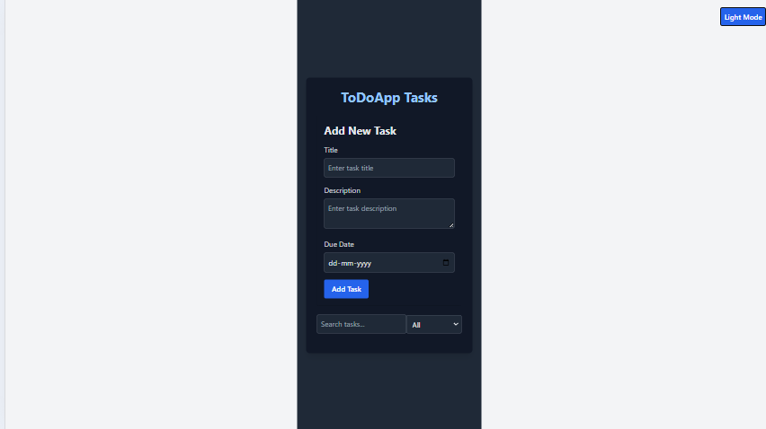
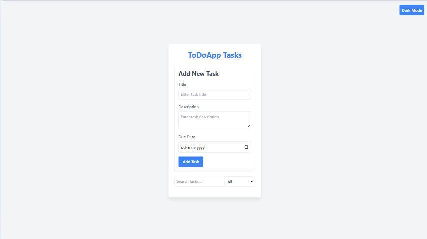

# To-Do List App

A comprehensive and feature-rich To-Do List application, designed with **TypeScript** and **Tailwind CSS**, providing a modern, responsive and user-friendly interface. This app offers an extensive range of functionalities tailored for seamless task management, ensuring both productivity and a delightful user experience.

## 🌐 Features Breakdown

### User-Centric Design
- **Responsive UI**: Optimized for all devices, ensuring seamless usability on desktops, tablets, and smartphones.
- **Dark Mode**: A sleek toggle for switching between light and dark themes, catering to user preferences.

### Core Functionalities
1. **Add and Manage Tasks**:
   - Input validation prevents empty or duplicate tasks.
   - Tasks are dynamically rendered on the screen with animations.
2. **Task Notifications**:
   - Browser alerts remind users of upcoming tasks.
   - Backend cron jobs send scheduled notifications for deadlines.
3. **Search and Filter**:
   - Search tasks by keywords in real-time.
   - Filter tasks by status (All, Completed, Pending).
   - Sort tasks by creation date or completion status.
4. **Edit and Delete Tasks**:
   - Inline editing for quick updates.
   - One-click deletion for removing unnecessary tasks.

### Developer Features
- **LocalStorage Persistence**: Tasks are saved locally, ensuring no data loss between sessions.
- **Mock API Integration**: CRUD operations simulate server-side interactions for a realistic experience.
- **Easy Setup**: The app is modular and easy to set up, making it ideal for learning and collaboration.

---

## 🛠️ Technology Stack
This project is a testament to the power of modern web development tools, built with a robust and efficient stack that ensures high performance, scalability, and developer productivity.

### Frontend
- **TypeScript**: Provides type safety and scalability for JavaScript, ensuring clean, maintainable code.
- **React**: Delivers a dynamic, component-based architecture for building interactive and responsive UIs.
- **Tailwind CSS**: Offers utility-first styling for creating a visually appealing and fully responsive design.

### Backend
- **Node.js**: Ensures a lightweight and efficient server-side runtime environment.
- **Express.js**: Simplifies API development with a minimal and flexible framework.
- **Mock APIs**: Simulates backend functionality for task management operations like Create, Read, Update, and Delete (CRUD).

### Database
- **LocalStorage**: Provides seamless client-side data persistence for storing tasks across sessions.
- **Mock Database (Optional)**: Simulated database functionality for handling server-like data interactions.

### Tools & Libraries
- **Vite**: Ensures blazing-fast development and build processes.
- **Node-Notifier**: Handles task notifications for reminders and deadlines.
- **Cron Jobs**: Schedules backend notifications for tasks with set deadlines.
- **ESLint & Prettier**: Maintains code quality and ensures consistent styling across the project.

---

## 📈 Why Choose This App?

This app isn’t just a task manager; it’s a productivity companion built with a meticulous focus on user needs and experience. Whether you’re a developer exploring new tools or a productivity enthusiast, the To-Do List App offers:
- A feature-rich, yet intuitive interface.
- Cutting-edge technology for blazing-fast performance.
- Expandable architecture for future enhancements.

Get started with this app to streamline your tasks and explore modern web development in action!

## 🌟 Screenshots

### Dark Mode


### Light Mode


## 🖥️ Installation Guide

### Prerequisites
- Node.js and npm installed.
- A modern browser.

### Steps
1. Clone the repository:
   ```bash
   git clone https://github.com/vjg1992/todo-app-typescript.git

2. Navigate to the project directories:
Frontend:
 ```bash
cd frontend
npm install
npm start
```

Backend: 
```bash
cd backend
npm install
npm start
```

3. Open the app in your browser:
Frontend: http://localhost:3000
Backend: http://localhost:5000

## 🎯 How to Use
Add tasks using the input field.
Mark tasks as completed with checkboxes.
Use the filters to view completed or pending tasks.
Search for specific tasks with the search bar.
Enjoy a seamless task management experience!

## 🤝 Contributing
Feel free to contribute by forking the repository and submitting pull requests.

## 📄 License
This project is licensed under the MIT License.
